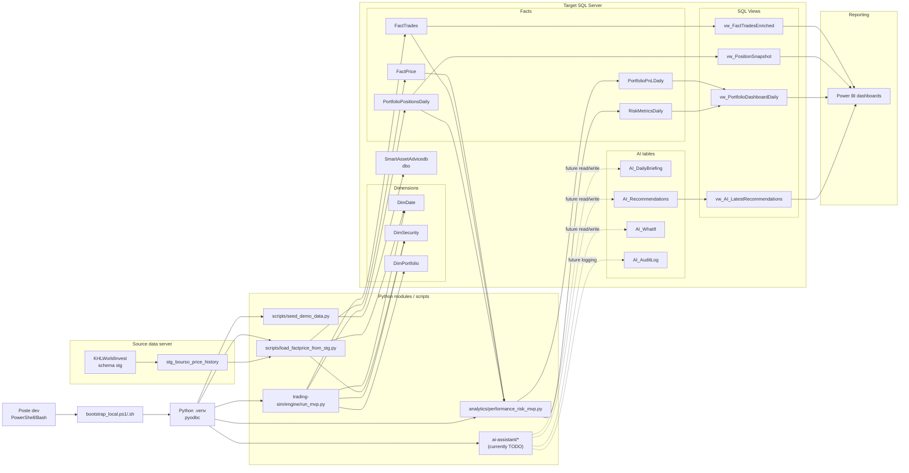
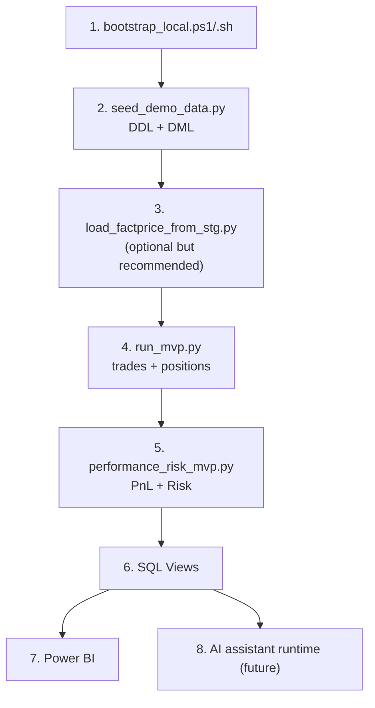
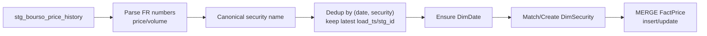
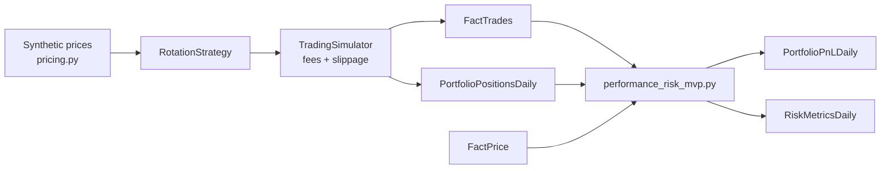
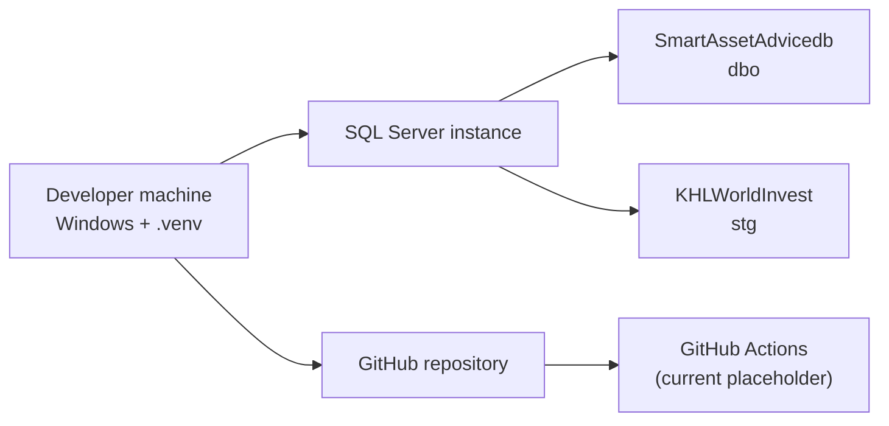

# Diagrams.net - Texte pret a coller (Mermaid)

## Comment l'utiliser dans app.diagrams.net
1. Ouvrir `https://app.diagrams.net/`
2. Menu `Arrange` -> `Insert` -> `Advanced` -> `Mermaid`
3. Coller un bloc ci-dessous
4. Cliquer `Insert`

---

## 1) Diagramme global complet (application end-to-end)

---

## 2) Workflow execution (ordre des traitements)

---

## 3) Diagramme detail ingestion FactPrice

---

## 4) Diagramme detail simulation + analytics

---

## 5) Diagramme serveurs / environnements

